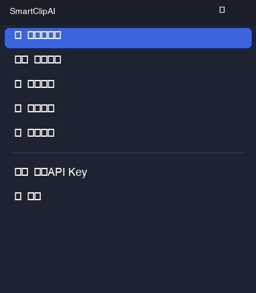
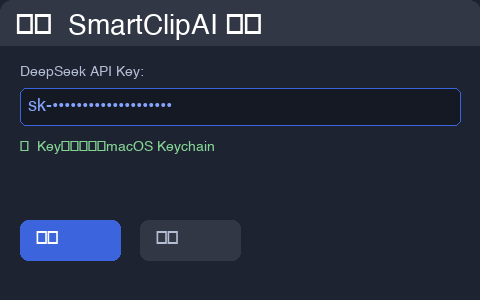
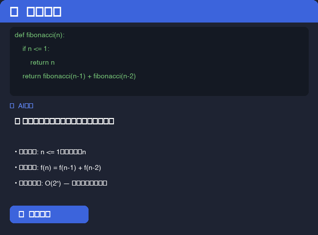
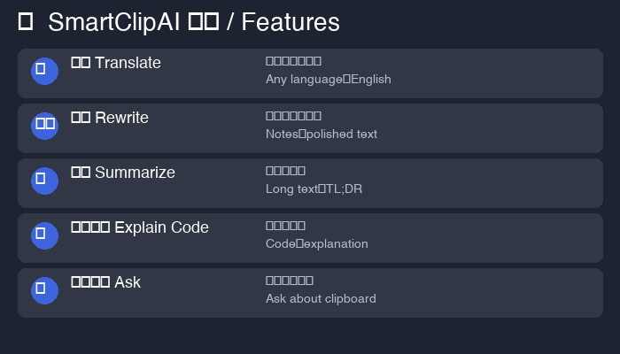
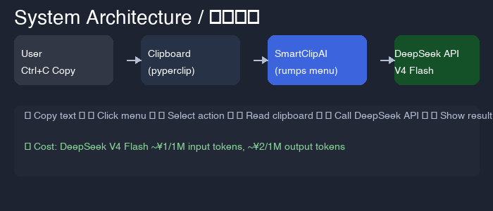

<p align="center">
  
</p>

<h1 align="center">SmartClipAI 🤖</h1>

<p align="center">
  <b>AI-powered clipboard assistant for macOS — translate, rewrite, summarize, explain code from your menu bar.</b><br>
  <b>AI 增强的 macOS 智能剪贴板助手 — 菜单栏一键翻译、润色、总结、解释代码。</b>
</p>

<p align="center">
  <a href="https://github.com/Monah-Limited/SmartClipAI/releases"></a>
  <a href="https://github.com/Monah-Limited/SmartClipAI/stargazers"></a>
  <a href="LICENSE"></a>
  <a href="https://www.python.org/"></a>
  <a href="https://github.com/Monah-Limited/SmartClipAI/actions"></a>
</p>

---

## 📸 截图 / Screenshots

<p align="center">
  
  
  
  <br>
  
  
</p>

---

## ✨ 功能特性 / Features

| 图标 Icon | 功能 Feature | 中文说明 | English |
|:---:|---|---|---|
| 🌍 | **翻译 Translate** | 任意语言 → 简体中文 | Any language → English |
| ✍️ | **润色 Rewrite** | 零碎笔记 → 专业文案 | Rough notes → polished text |
| 📝 | **总结 Summarize** | 长文章 → 核心要点 | Long article → TL;DR |
| 💻 | **解释代码 Explain Code** | 任何代码 → 清晰解释 | Any code → clear explanation |
| 🤖 | **自由提问 Ask** | 基于剪贴内容任意提问 | Ask anything about clipboard |

---

## 🚀 快速开始 / Quick Start

### 方式一：下载 DMG（推荐）

**中文：** 从 [Releases 页面](https://github.com/Monah-Limited/SmartClipAI/releases) 下载最新的 `.dmg` 文件，打开并将 SmartClipAI.app 拖入 Applications 文件夹。

**English:** Download the latest `.dmg` from the [Releases page](https://github.com/Monah-Limited/SmartClipAI/releases), open it and drag SmartClipAI.app to your Applications folder.

```bash
# 首次打开需要右键 → 打开（因未签名）
# First time: right-click → Open (unsigned app)
```

<div align="center">
  
</div>

### 方式二：源码运行 / Run from Source

**中文** | **English**
---|---
克隆仓库：`git clone https://github.com/Monah-Limited/SmartClipAI.git` | Clone the repo
安装依赖：`pip install -r requirements.txt` | Install dependencies
运行：`python src/smartclipai.py` | Run the app

### 2. 配置 API Key / Configuration

**中文：** 点击菜单栏 📋 图标 → **设置** → 输入你的 DeepSeek API Key。Key 会安全存储在 macOS Keychain 中。

**English:** Click the 📋 icon in your menu bar → **Settings** → enter your DeepSeek API key. The key is stored securely in macOS Keychain.

> 💡 **获取 API Key / Get your API key:** [platform.deepseek.com](https://platform.deepseek.com)
> 
> 💰 **价格 / Pricing:** DeepSeek V4 Flash — 约 ~¥1 / 1M input tokens, ~¥2 / 1M output tokens（极低价格 / extremely cheap）

### 3. 使用指南 / How to Use

```
1. 复制任意文本（Cmd+C） / Copy any text (Cmd+C)
2. 点击菜单栏 📋 图标 / Click the 📋 icon in menu bar
3. 选择操作（翻译/润色/总结/解释代码/提问） / Choose an action
4. 结果弹出窗口 / Result appears in popup
5. 点击"复制结果"保存 / Click "Copy" to save
```

---

## 🔧 技术栈 / Tech Stack

| 中文 | English | 用途 Purpose |
|------|---------|-------------|
| [rumps](https://github.com/jaredks/rumps) | macOS Menu Bar Framework | 菜单栏界面 |
| [pyperclip](https://github.com/asweigart/pyperclip) | Clipboard Access | 剪贴板读写 |
| [DeepSeek](https://platform.deepseek.com) V4 Flash API | AI Engine | 翻译/润色/总结/代码解释 |
| [pyobjc](https://github.com/ronaldoussoren/pyobjc) | macOS Native Bindings | 系统原生交互 |
| [Pillow](https://python-pillow.org/) | Image Processing | 图标生成 |
| macOS Keychain | Secure Storage | API Key 安全存储 |

---

## 📦 生成 DMG 安装包 / Build DMG

**中文：** 运行以下命令即可生成 `.dmg` 安装包：

**English:** Run the following command to generate the `.dmg` installer:

```bash
make dmg
```

DMG 文件会生成在 `dist/SmartClipAI.dmg`。

---

## 🧠 "30 天 30 个 macOS 应用" / 30 macOS Apps in 30 Days

**中文：** 这是 **30 天 30 个 macOS 开源应用** 挑战的 Day 1 作品。每天发布一个高质量的 macOS 开源工具。

**English:** This is Day 1 of the **30 macOS Apps in 30 Days** challenge — publishing one high-quality open-source macOS app every day.

> 关注旅程 / Follow the journey: [@timwynter](https://github.com/timwynter) on GitHub

---

## 🤝 贡献 / Contributing

**中文：** PR 欢迎！可以添加的新功能方向：

**English:** PRs welcome! Ideas for new features:

| 中文 | English |
|------|---------|
| 🎨 格式化 JSON/XML/代码 | Format JSON/XML/code |
| 🔍 语法检查 | Grammar check |
| 🌐 多语言翻译 | Multi-language translation |
| 📧 写邮件回复 | Write email replies |
| 🖼️ OCR 图片文字识别 | OCR image text |

---

## 📄 许可证 / License

**中文：** MIT 许可证 — 可自由使用、修改、分发。

**English:** MIT License — free to use, modify, and distribute.

---

<p align="center">
  
  <br>
  <b>⭐ 如果这个项目对你有帮助，请点个 Star！</b>
  <br>
  <b>If you find this useful, please give it a star!</b>
</p>
